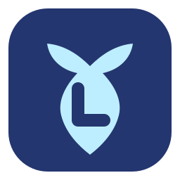
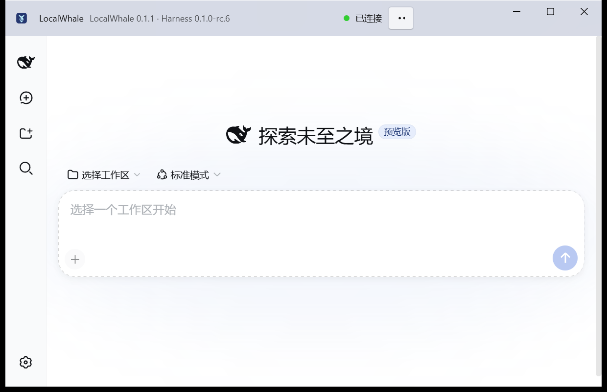
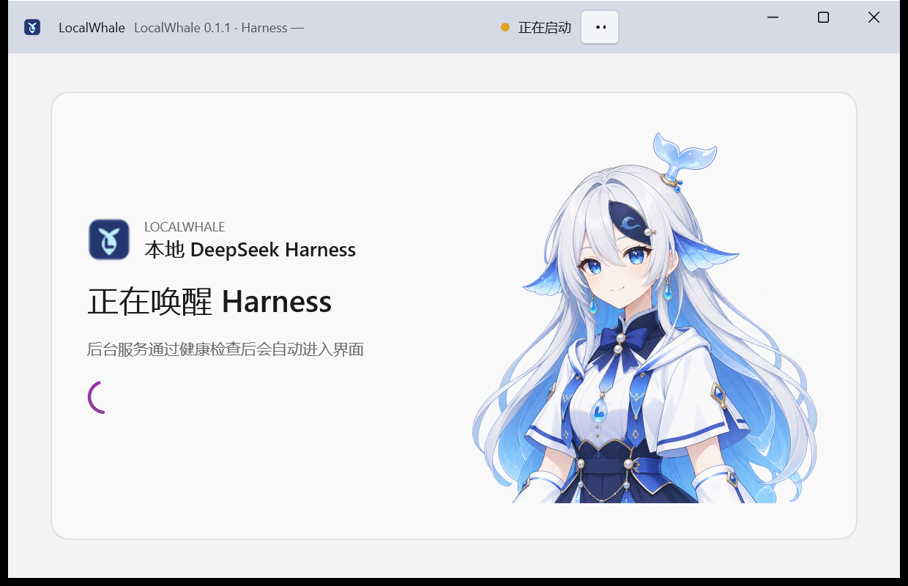
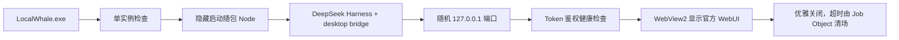

<p align="center">
  
</p>

<h1 align="center">LocalWhale</h1>

<p align="center">
  <strong>用 WinUI 3 把 DeepSeek Harness 带到 Windows 桌面。</strong><br>
  <strong>A native WinUI 3 desktop home for DeepSeek Harness.</strong>
</p>

<p align="center">
  <a href="https://github.com/penglai-doll/LocalWhale/releases/latest"></a>
  <a href="https://learn.microsoft.com/en-us/windows/apps/winui/winui3/"></a>
  <a href="https://www.microsoft.com/windows/windows-11"></a>
  <a href="https://dotnet.microsoft.com/"></a>
  <a href="https://github.com/deepseek-ai/deepseek-harness"></a>
  <a href="https://github.com/topics/dsh-plugin"></a>
  <a href="https://github.com/penglai-doll/LocalWhale/actions/workflows/ci.yml"></a>
  <a href="LICENSE"></a>
</p>

<p align="center">
  <a href="https://github.com/penglai-doll/LocalWhale/releases/latest"><strong>下载最新版 / Download</strong></a>
  · <a href="docs/releases/v0.1.1.md">v0.1.1 更新日志 / Release notes</a>
  · <a href="https://github.com/deepseek-ai/deepseek-harness">DeepSeek Harness</a>
</p>

LocalWhale 是一个基于 **.NET 10、WinUI 3 和 Windows App SDK** 的原生 Windows 11 桌面宿主。运行 `LocalWhale.exe` 后，它会隐藏启动随包携带的 Node/Harness 服务，通过带鉴权的健康检查确认就绪，再由 WebView2 显示未修改的官方 WebUI。

LocalWhale is a native Windows 11 host built with **.NET 10, WinUI 3, and the Windows App SDK**. Launching `LocalWhale.exe` starts the bundled Node/Harness service invisibly, waits for an authenticated health check, and then presents the unchanged upstream WebUI in WebView2.

| 特点 / Highlight | 实现 / What it means |
|---|---|
| **原生 WinUI 3 / Native WinUI 3** | Windows App SDK `TitleBar`、Mica、Fluent 控件、系统托盘、Snap 与高 DPI。 |
| **官方插件机制 / Official plugin model** | desktop bridge 通过 Harness `--patch` 作为 Cordis 插件加载，遵循上游 “Everything is a Plugin” 架构。 |
| **官方界面原样保留 / Upstream UI preserved** | 不注入 CSS、不套 iframe、不 fork Harness 前端；主题仅作用于 WinUI 宿主。 |
| **离线即用 / Self-contained** | 安装包内置 Node、pnpm、Harness、.NET 运行文件和 WebView2 Evergreen 离线安装器。 |
| **桌面级生命周期 / Desktop lifecycle** | 隐藏启动、单实例、随机本机端口、托盘、优雅关闭、Job Object 清场、更新验证与回滚。 |

> LocalWhale 是独立的社区项目，与 DeepSeek 没有隶属或官方背书关系。DeepSeek Harness 页面及信息架构保持原样，不注入 CSS，不使用 iframe，也不 fork 官方前端。LocalWhale 图标与鲸鱼娘角色是本项目的原创社区视觉资产，不代表 DeepSeek 官方形象。

| 默认 Fluent 主题 / Original | 可选鲸鱼娘主题 / WhaleGirl |
|---|---|
|  |  |

## 中文说明

### 为什么做 LocalWhale

官方 Harness 提供的是本地 WebUI，直接使用时通常需要自己管理 Node、包管理器、终端窗口、端口和服务退出。LocalWhale 把这些“启动器日常任务”收进一个原生 WinUI 3 外壳：

- **WinUI 3 原生桌面体验：** 使用 Windows App SDK `TitleBar`、Mica、Fluent 控件、系统窗口按钮、Snap 和高 DPI 命中区。
- **双击 EXE 即用：** 不要求系统已安装 Node、pnpm 或 .NET Runtime。
- **遵循官方插件架构：** desktop bridge 通过 `--patch` 作为 Cordis 插件加载；仓库按照官方建议使用 [`dsh-plugin`](https://github.com/topics/dsh-plugin) topic。
- 后台服务不弹终端窗口；随机监听 `127.0.0.1` 端口，不暴露到局域网。
- EXE、任务栏、Alt+Tab、托盘和安装器统一使用简洁的 LocalWhale 鲸尾图标。
- 默认保持克制的 Fluent 外观，也可以从标题栏菜单切换到鲸鱼娘主题。
- WebView2 直接加载官方 Harness 页面，宿主不修改官方前端。
- 默认关闭窗口即完全退出；可切换为关闭到系统托盘。
- 退出时优先请求 Harness 优雅关闭，超时后由 Job Object 清理整棵子进程树。
- Harness 与桌面外壳独立版本管理，候选 Harness 更新需先通过隔离冒烟测试。
- 首次创建官方 profile 时若遇到已知的模块链接竞态，LocalWhale 会保留诊断并仅自动重试一次。

### 下载与安装

支持范围：**Windows 11 x64**。

1. 打开本仓库的 [**Releases** 页面](https://github.com/penglai-doll/LocalWhale/releases/latest)。
2. 下载 `LocalWhale-Setup-x64.exe`，可同时下载 `SHA256SUMS.txt` 校验文件。
3. 运行标准安装向导。安装目录页始终显示，可选择任意有写入权限的位置；默认目录为 `%LOCALAPPDATA%\Programs\LocalWhale`。
4. 可选创建桌面快捷方式，安装完成后启动 LocalWhale。

安装器是按用户安装，不请求管理员权限；Node 24、pnpm、Harness、WinUI 运行文件和 WebView2 Evergreen 离线安装器都已随包携带。首个个人发布版本未进行商业代码签名，因此 Windows 可能显示“未知发布者”提示，请只从本仓库 Release 下载并核对 SHA-256。

### 外观与主题

v0.1.1 使用 Windows App SDK 的原生 `TitleBar`、Mica、Fluent 卡片和 `InfoBar` 重新整理了桌面宿主。默认的“默认主题”跟随 Windows 浅色、深色与高对比度设置；“鲸鱼娘主题”使用海军蓝、长春花蓝与冰青配色，并只在启动、恢复与关于界面显示本项目原创角色。窗口窄于 760 逻辑像素或系统处于高对比度模式时，角色装饰会自动隐藏，让文字和操作按钮保持清晰。

主题只影响 LocalWhale 自己的标题栏、启动/恢复卡片、更新提示和关于对话框。WebView2 中的官方 Harness DOM、CSS、页面结构及插件界面完全不变。可在右上角 `…` →“外观主题”即时切换；选择会写入 `%LOCALAPPDATA%\LocalWhale\settings.json`，重启后继续使用。

从 v0.1.0 覆盖安装时，旧设置文件没有主题字段也能直接读取，并默认选择“默认主题”；关闭行为、忽略的 Harness 版本与上次更新检查时间都会保留。此迁移不会读取、移动或重写 `%USERPROFILE%\.dsh`。

### 启动与退出流程



bridge 只增加两个本机宿主端点：

- `GET /__localwhale/v1/health`
- `POST /__localwhale/v1/shutdown`

它们要求每次启动随机生成、仅驻留内存的 `X-LocalWhale-Token`。端口、PID 和 token 都不会写入磁盘。

### 数据边界

| 数据 | 位置 | 卸载行为 |
|---|---|---|
| DeepSeek Harness 会话、设置与凭据 | `%USERPROFILE%\.dsh` | **始终保留** |
| LocalWhale 设置与运行状态 | `%LOCALAPPDATA%\LocalWhale` | 删除 |
| WebView2 用户数据 | `%LOCALAPPDATA%\LocalWhale\webview2` | 删除 |
| Harness 版本与更新 staging | `%LOCALAPPDATA%\LocalWhale\runtimes` | 删除 |
| 脱敏日志 | `%LOCALAPPDATA%\LocalWhale\logs` | 删除 |

LocalWhale 不读取、复制或迁移 Harness API Key。日志会脱敏 token、密钥形式的参数和敏感环境变量，并保留最多 14 天、总量不超过 50 MiB。

### Harness 更新保护

应用成功启动后会检查官方 npm registry，自动检查最多每 24 小时一次，也可以从标题栏菜单手动检查。发现新版后可更新、稍后或忽略该版本。

候选版本不会直接覆盖当前版本。更新器会在临时目录中生成锁文件、验证 registry integrity、预取并离线安装，然后使用临时 `DSH_HOME` 和 WebView2 数据目录执行 bridge、首页加载、前端启动错误与优雅关闭冒烟测试。未知生命周期脚本会使候选版被拒绝；验证失败时当前会话和当前已知良好版本保持不变。新版连续启动失败时运行状态策略会回滚到上一版本。

桌面外壳本身不进行应用内自更新；新版本通过重新运行 Setup 覆盖安装。

### 常见问题

#### 显示“Harness 启动失败”

先在右上角 `…` 菜单选择“打开日志”。v0.1.0 已修复官方 Harness 首次创建 profile 链接时可能出现的 `ERR_MODULE_NOT_FOUND`：只在错误来源确实位于当前 `DSH_HOME\profiles` 时自动启动第二次，端口占用和其他启动错误不会被误判重试。

如仍失败，请在 Issue 中附上：

- LocalWhale 与 Harness 版本；
- Windows 版本；
- 脱敏后的日志末尾；
- 安装路径是否包含中文或空格；
- 是否能够稳定复现。

请勿上传 `%USERPROFILE%\.dsh`、API Key、完整环境变量或私人会话内容。

#### 重启后配置像“消失”了

正常发布版始终使用官方默认 `%USERPROFILE%\.dsh`，卸载也不会删除它。开发验收时可通过 `DSH_HOME` 启动隔离配置；这只会显示另一个配置目录，不代表原数据被删除。

#### 3080 端口被占用

无影响。LocalWhale 使用 `--port 0` 让系统分配空闲端口，不依赖固定的 3080。

### 从源码构建

要求：

- Windows 11 x64；
- [.NET 10 SDK](https://dotnet.microsoft.com/download/dotnet/10.0)；
- [Inno Setup 6](https://jrsoftware.org/isinfo.php)（仅构建安装包需要）；
- 网络连接（首次准备固定版本的发布运行包时需要）。

```powershell
dotnet test .\LocalWhale.slnx -c Release
dotnet build .\LocalWhale.slnx -c Release
node --test .\bridge\test\bridge.test.mjs
.\tools\Build-Release.ps1
```

生成结果：

- unpackaged self-contained 应用：`artifacts\publish\`
- 标准安装包：`artifacts\installer\LocalWhale-Setup-x64.exe`

`Build-Release.ps1` 会下载并校验固定版本的 Node、pnpm、Harness 和 WebView2 离线安装器。CI 只构建和测试源码，不发布未经本地验收的安装包。

### 工程结构

```text
src/LocalWhale.App/       WinUI 3、TitleBar、Mica、WebView2、托盘与更新卡片
src/LocalWhale.Core/      生命周期、Job Object、持久化、日志、更新与回滚策略
bridge/                   通过 Harness --patch 加载的 Cordis 桌面 bridge
installer/                Inno Setup 脚本与简体中文语言文件
tests/                    xUnit 单元/集成测试与 Node bridge 测试
tools/                    运行包准备、发布构建和验收脚本
licenses/                 上游 MIT License 与第三方声明
```

固定的初始运行版本：

| 组件 | 版本 |
|---|---:|
| LocalWhale | 0.1.1 |
| DeepSeek Harness | 0.1.0-rc.6 |
| Node.js | 24.18.1 |
| pnpm | 11.7.0 |
| Windows App SDK | 2.3.1 |

### 当前状态与资源观测

这是面向个人本机使用的公开 preview。v0.1.0 开发机 Release x64 二次稳定验收样本中，启动约 1.85 秒、Harness Node 私有内存约 121 MiB、空闲 CPU 约 0.013%、完全退出约 0.53 秒；安装发布目录约 395 MiB。外壳私有内存约 110 MiB，外壳、Harness 与 WebView2 后代进程的工作集直接求和约 684 MiB（其中会重复计算共享页），尚未达到最初的 90 MiB / 350 MiB 资源目标。v0.1.1 的鲸鱼娘 PNG 解码后理论像素占用约 5.2 MiB，并且默认主题不会加载该图片。WebView2 版本、页面内容、GPU 和系统缓存都会显著影响这些数字；它们是单机观测，不是跨机器保证。

当前不支持 Windows 10、ARM64、Microsoft Store、跨平台、公开更新签名或完整 DeepSeek fork。

## English

### What LocalWhale provides

LocalWhale packages the official DeepSeek Harness WebUI as a native Windows 11 x64 desktop experience:

- a native WinUI 3 and Windows App SDK shell with `TitleBar`, Mica, Fluent controls, Snap, tray integration, and high-DPI behavior;
- a Cordis desktop bridge loaded through the official Harness `--patch` plugin mechanism; this repository follows the upstream recommendation to use the [`dsh-plugin`](https://github.com/topics/dsh-plugin) topic;
- one simple LocalWhale mark across the executable, taskbar, Alt+Tab, tray, and installer;
- an Original theme by default plus an optional WhaleGirl host theme;
- WebView2 hosting without CSS injection, iframe wrapping, or upstream UI changes;
- bundled Node, pnpm, Harness, and an offline WebView2 installer;
- hidden service startup on a random loopback port;
- per-launch token authentication for the desktop health/shutdown bridge;
- graceful shutdown followed by Job Object process-tree cleanup;
- single-instance activation, optional tray behavior, redacted rotating logs;
- isolated validation and rollback protection for Harness updates;
- one bounded retry for the upstream first-profile module-link race.

### Install

Download `LocalWhale-Setup-x64.exe` from this repository's [Releases page](https://github.com/penglai-doll/LocalWhale/releases/latest). The per-user Inno Setup wizard always shows the destination directory page and defaults to `%LOCALAPPDATA%\Programs\LocalWhale`. No system Node, pnpm, .NET Runtime, or network connection is required for first launch.

The initial personal release is unsigned. Download only from this repository and compare the installer against `SHA256SUMS.txt` when Windows reports an unknown publisher.

### Appearance and v0.1.0 upgrades

Version 0.1.1 adopts the Windows App SDK `TitleBar`, Fluent startup/recovery cards, and a native `InfoBar` for Harness updates. Original remains the default and follows Windows light, dark, and high-contrast modes. WhaleGirl is opt-in from `…` → **Appearance theme** and adds the project's original, AI-assisted community character only to host-owned startup, recovery, and About surfaces. The artwork collapses in narrow windows and is disabled in high contrast.

Neither theme injects styles or scripts into WebView2. The upstream Harness DOM, CSS, information architecture, and client plugins remain unchanged. A v0.1.0 `settings.json` without a theme field migrates to Original while preserving close behavior, ignored Harness versions, and the last update-check time. Official data and credentials in `%USERPROFILE%\.dsh` are never read, moved, or rewritten by this migration.

### Privacy and local data

Official Harness data remains in `%USERPROFILE%\.dsh`; LocalWhale never removes it during uninstall. Shell settings, runtime packages, WebView2 data, staging files, and redacted logs live under `%LOCALAPPDATA%\LocalWhale` and are removed by the uninstaller. Bridge tokens, ports, and PIDs are memory-only.

### Build and test

On Windows 11 x64 with the .NET 10 SDK:

```powershell
dotnet test .\LocalWhale.slnx -c Release
dotnet build .\LocalWhale.slnx -c Release
node --test .\bridge\test\bridge.test.mjs
.\tools\Build-Release.ps1
```

The installer is written to `artifacts\installer\LocalWhale-Setup-x64.exe`. See the Chinese sections above for the architecture, update safety model, data boundary, troubleshooting checklist, repository map, and measured resource notes.

## Contributing

Bug reports and focused pull requests are welcome. Please include a reproducible case and keep changes within the project's boundary: the WinUI desktop host may integrate with Harness through the documented patch/plugin mechanism, but it must not silently fork or restyle the official WebUI. In line with the [DeepSeek Harness community guidance](https://github.com/deepseek-ai/deepseek-harness#community-and-support), compatible integrations can use the `dsh-plugin` topic for discovery.

Before submitting a change, run both the .NET and bridge test suites. Never commit API keys, `%USERPROFILE%\.dsh`, generated runtimes, WebView2 user data, logs, or installer artifacts.

## License

LocalWhale source code is available under the [MIT License](LICENSE). DeepSeek Harness remains under its upstream MIT License; its license copy and other redistributed-component notices are in [`licenses/`](licenses/).

DeepSeek and related marks belong to their respective owners. LocalWhale is an independent community project and is not affiliated with, endorsed by, or sponsored by DeepSeek. The LocalWhale mark and WhaleGirl character are original community-project assets and are not official DeepSeek branding.
